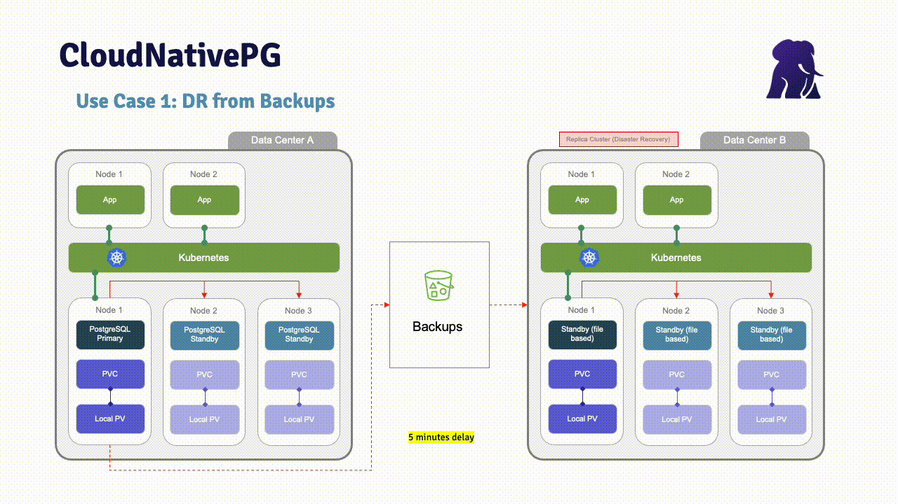

[](https://shields.io/)
[](https://GitHub.com/Naereen/StrapDown.js/graphs/commit-activity)

# Prerequisites
- Have a working kubernetes platform up & running.
- If you don't have it, install Docker.
- Install a kubernetes environment (I recommend [k3d](https://k3d.io/v5.3.0/) or [kind](https://kind.sigs.k8s.io))
- Install [MinIO](https://min.io/download#/kubernetes) Server. Script `start_minio_docker_server.sh` can do it for you.
- Latest CloudNativePG version tested: 1.27.0
- If you are using AWS:
  - AWS account (if backups in AWS)
  - Install [AWS CLI (Command-line interface)](https://docs.aws.amazon.com/cli/latest/userguide/getting-started-install.html)
  - AWS S3 bucket

# Description
These scripts are based in CloudNativePG project:
- [CloudNativePG](https://cloudnative-pg.io)
- [CloudNativePG github](https://github.com/cloudnative-pg/cloudnative-pg)

The aim is to be able a demo of CloudNativePG in a kubernetes environment.
To replicate data from one cluster to other, you must use an object storage. This demo has been configured to use MinIO (default configuration) or AWS S3.
If you have any problem, don't hesitate to contact me: sergio.romera@enterprisedb.com

# MinIO Users
If you are using MinIO to store backups ans WALs, start MinIO server before to continue with the test. MinIO will run in a Docker container.

```
./start_minio_docker_server.sh
```
```
Unable to find image 'minio/minio:latest' locally
latest: Pulling from minio/minio
Digest: sha256:16a0b1807bf9c7f1c2ea8558ae067a0352614e26bd4e6a898688a16d30747e31
Status: Downloaded newer image for minio/minio:latest
API: http://172.17.0.2:9000  http://127.0.0.1:9000

Console: http://172.17.0.2:9001 http://127.0.0.1:9001

Documentation: https://docs.min.io
```
To stop MinIO server, click on ctrl+C. Warning, all the data of your WAL files and backups will be dropped.

MinIO will be accessible from this URL: http://localhost:9001/login

```
MinIO User: admin
MinIO Password: password
```


# AWS Users
If you use AWS S3, modify `install_secrets.sh` file and configure AWS credentials to store backup files in a AWS S3 bucket
```
...
kubectl create secret generic aws-creds \
  --from-literal=ACCESS_KEY_ID=<access_key_id> \
  --from-literal=ACCESS_SECRET_KEY=<access_secret_key> \
  --from-literal=ACCESS_SESSION_TOKEN="$AWS_SESSION_TOKEN"
...
```
# Use case 1
## Disaster Recovery from S3 backups

```
# Create cluster 1
01_usecase1_create_cluster1.sh                       

# Insert data
02_usecase1_insert_data_cluster1.sh                  

# Backup cluster 1
03_usecase1_backup_cluster1.sh                       

# Verify backup status
04_usecase1_verify_backup.sh                         

```

```

# Create cluster 2
05_usecase1_create_cluster2.sh                       

# Switchover to cluster 2
06_usecase1_switchover_cluster2.s                    

# Delete clusters
07_usecase1_delete_clusters.sh                       
```

# Use case 2
## Disaster Recovery using wal streaming replication 


```
# Create cluster 1
10_usecase2_create_cluster1.sh                       

# Insert data
11_usecase2_insert_data_cluster1.sh                  

# Backup cluster 1
12_usecase2_backup_cluster1.sh                       

# Verify backup
13_usecase2_verify_backup.sh                         

# Create cluster 2
14_usecase2_create_cluster2.sh                       

# Switchover cluster2
15_usecase2_switchover_cluster2.sh                   

# Backup cluster 2
16_usecase2_backup_cluster2.sh                       
# Verify bcakup
17_usecase2_verify_backup.sh                         

# Rollback to cluster1
# Create cluster 1 from cluster 2
18_usecase2_rollback_create_cluster1_from_cluster2.sh
```

# Usefull commands
```
# CNP
./show_cluster1.sh
./show_cluster2.sh

# psql
select pg_switch_wal();
select pg_current_wal_lsn();
select current_user;

# kubectl
kubectl exec -it cluster1-1 -- psql
kubectl exec -it cluster2-1 -- psql
kubectl cnp promote cluster1 cluster1-2
kubectl apply -f backup_cluster1.yaml
kubectl describe backup backup-test
kubectl logs cluster1-1

# Port Forwarding
kubectl port-forward cluster1-1 5432:5432
kubectl port-forward service/cluster1-rw 5454:5432
```
